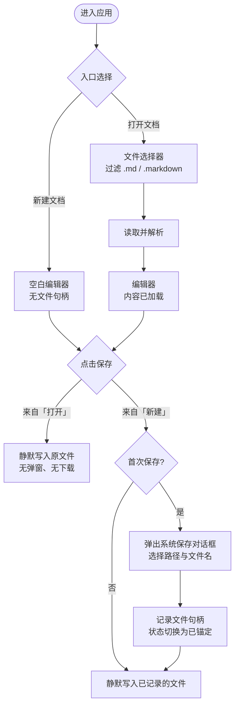

# 01 · 核心编辑流程（第一阶段）

> 本文档定义 `md-editor-web` **第一阶段** 的业务流程：**入口分流 → 编辑 → 保存**。
> 主题、自动暂存、多文档并行等话题不在本阶段范围内，会在后续阶段单独成文。

---

## 1. 流程总览

应用启动后进入入口页，用户在两条路径中选择其一：

- **路径 A · 新建文档**
  1. 进入空白编辑器（标题暂为 `untitled.md`，无文件句柄）
  2. 编辑
  3. 点击「保存」 → 首次保存弹保存路径，后续保存静默写入

- **路径 B · 打开文档**
  1. 弹出系统文件选择器（过滤 `.md` / `.markdown`）
  2. 读取并解析选中的文件
  3. 进入编辑器（内容已加载）
  4. 编辑
  5. 点击「保存」 → 静默写入原文件

### 流程图（Mermaid）

---

## 2. 入口分流（首页 / Landing）

应用启动默认进入首页 `/`，提供两个动作入口：

| 动作 | 行为 |
| --- | --- |
| **新建文档** | 直接进入空白编辑器；标题暂为 `untitled.md`，不持有文件句柄 |
| **打开文档** | 弹出系统文件选择器（过滤 `.md` / `.markdown`），读取后进入编辑器 |

> 入口页的视觉与文案（按钮措辞、欢迎语、是否展示「最近文档」）属于后续阶段；本阶段只需保证**两条路径均可触发**。

---

## 3. 分支 A · 新建文档

| 步骤 | 行为 |
| --- | --- |
| 1 | 用户点击「新建文档」 |
| 2 | 进入空白编辑器；标题默认 `untitled.md`，无文件句柄 |
| 3 | 用户编辑（输入、格式调整等） |
| 4 | 用户点击「保存」 |
| 5 | **首次保存**：弹出系统保存对话框 → 用户选择路径 + 文件名 |
| 6 | 保存成功后，**记录文件句柄**；状态切换为「已锚定文件」 |
| 7 | **后续保存**：直接写入已记录的文件，无弹窗、无下载 |

---

## 4. 分支 B · 打开文档

| 步骤 | 行为 |
| --- | --- |
| 1 | 用户点击「打开文档」 |
| 2 | 弹出系统文件选择器（过滤 `.md` / `.markdown`） |
| 3 | 用户选定文件 → 读取内容 → 解析为编辑器内部模型 |
| 4 | 进入编辑器，内容回填，**记录文件句柄** |
| 5 | 用户编辑 |
| 6 | 用户点击「保存」 |
| 7 | 直接写入已记录的文件，**无弹窗、无下载** |

---

## 5. 共有的编辑期行为

两条分支在编辑期内行为一致：

- **不自动保存**，必须由用户主动点击「保存」
- 关闭标签页 / 刷新页面 / 退出应用时如何处理未保存内容 —— 后续阶段
- 自动保存（auto-save）策略 —— 后续阶段
- 编辑器内是否显示「未保存」指示（dot / 状态文字 / 标题栏前缀）—— **待澄清**

---

## 6. 关键行为对比

| 维度 | 新建文档 | 打开文档 |
| --- | --- | --- |
| 首次保存 | 弹窗选路径 | （不适用，进入时已持有文件） |
| 后续保存 | 静默写入 | 静默写入 |
| 触发浏览器下载事件 | ❌ 永不触发 | ❌ 永不触发 |
| 触发系统保存对话框 | 仅首次 | ❌ 永不触发 |
| 文件句柄生命周期 | 自首次保存起 | 自打开起 |
| 文档内容来源 | 编辑器内累积 | 磁盘读取后回填 |

---

## 7. 与 draw.io 的对照

[draw.io](https://www.drawio.com/) 的 web 端体验是本流程的明确对标：

- 进入即询问「新建 / 打开 / 模板 / 从 URL」
- 「打开设备文件」后整段会话围绕该文件，保存 = 直接覆盖
- 「新建」首次导出/保存弹系统保存框，之后覆盖同名文件

> ⚠️ **差异**：draw.io 实际走的是浏览器 `<a download>`，**仍会出现浏览器下载提示**。本项目的目标更进一步：**永不出现下载提示**，需要浏览器原生的 `FileSystemFileHandle` 写权限（详见 §8）。

---

## 8. 技术预研备注（不属于本阶段范围，供参考）

本阶段定义的「静默写入」语义依赖浏览器侧三个核心 API：

| API | 用途 |
| --- | --- |
| `window.showOpenFilePicker()` | 触发系统文件选择器，返回 `FileSystemFileHandle` |
| `window.showSaveFilePicker()` | 触发系统保存对话框，返回 `FileSystemFileHandle` |
| `FileSystemFileHandle.createWritable()` | 拿到 `FileSystemWritableFileStream`，可重复 `write()` 而无需再次确认 |

兼容性矩阵（截至本文撰写）：

| 浏览器 | 支持情况 |
| --- | --- |
| Chrome / Edge / Opera / Brave | ✅ 原生支持 |
| Safari | ⚠️ 部分版本支持，需运行时检测 |
| Firefox | ❌ 暂不支持，需降级方案 |

降级路径（Firefox / 旧 Safari）是否纳入**第一阶段**交付 —— **待澄清**。

---

## 9. 待澄清 / 开放问题

> 本节原为 §9 开放问题。澄清访谈完成后状态如下（决议细节见 [02-editor-and-experience.md §9.2](./02-editor-and-experience.md#92-phase-1-§9-推迟项决议) 与 [03-file-capabilities.md §8](./03-file-capabilities.md#8--待澄清-决议记录)）。

- [x] 编辑器内是否显示「未保存」指示？→ Phase 2 决议：标题栏圆点（Phase 2 §5.2）
- [x] 关闭标签页 / 刷新页面 / 退出应用时，未保存内容如何提示？→ Phase 2 决议：浏览器原生 `beforeunload`（Phase 2 §5.3 / §9 #5）
- [x] 是否需要「另存为」？→ Phase 3 已纳入；F-SA-1~8
- [x] 新建文档的默认文件名？→ `untitled.md`（Phase 2 §9 #15）
- [x] 打开时除 `.md` / `.markdown` 外，是否兼容 `.mdx` / `.txt`？→ 否，仅 `.md` + `.markdown`（Phase 2 §9 #16）
- [x] Firefox / Safari 的降级路径？→ 仅 Chromium 浏览器为目标，其他浏览器入口提示（Phase 2 §9 #17）
- [x] 自动保存（auto-save）是否在后续阶段引入？→ Phase 2 决议：启用，输入防抖 5 秒
- [x] 外部修改检测？→ Phase 3 已纳入；F-EM-1~11